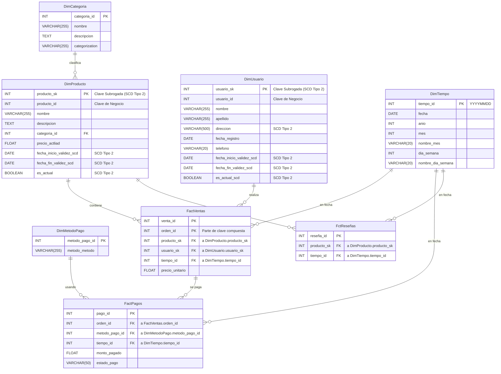

# Modelo Dimensional para E-commerce

## 1. Análisis de negocio y descubrimiento de requisitos

## Objetivo del negocio:
  - El negocio quiere entender mejor el rendimiento de ventas, el comportamiento de los usuarios y la performance de los productos, con el fin de:

  - Optimizar el stock.

  - Mejorar la experiencia del cliente.

  - Aumentar los ingresos.

  - Identificar oportunidades de crecimiento.

### Preguntas clave:
- ¿Cuáles son los productos más vendidos por volumen?
- ¿Cuál es el ticket promedio por orden?
- ¿Cuáles son las categorías con mayor número de productos vendidos?
- ¿Qué día de la semana se generan más ventas?
- ¿Cuántas órdenes se generan cada mes y cuál es su variación?
- ¿Cuáles son los métodos de pago más utilizados?
- ¿Cuál es el monto promedio pagado por método de pago?
- ¿Cuántas órdenes se pagaron usando más de un método de pago?
- ¿Cuántos pagos están en estado 'Procesando' o 'Fallido'?
- ¿Cuál es el monto total recaudado por mes?
- ¿Cuántos usuarios se registran por mes?
- ¿Cuántos usuarios han realizado más de una orden?
- ¿Cuántos usuarios registrados no han hecho ninguna compra?
- ¿Qué usuarios han gastado más en total?
- ¿Cuántos usuarios han dejado reseñas?
- ¿Qué productos tienen alto stock pero bajas ventas?
- ¿Cuántos productos están actualmente fuera de stock?
- ¿Cuáles son los productos peor calificados?
- ¿Qué productos tienen mayor cantidad de reseñas?
- ¿Qué categoría tiene el mayor valor económico vendido?

### Entidades disponible para esto:
- Usuarios: Información de los usuarios registrados
- Categorias: Categorías o clasificaciones de productos
- Productos: Catálogo de productos disponibles
- Ordenes: Órdenes de compra realizadas por los usuarios
- DetalleOrdenes: Productos y cantidades asociadas a cada orden
- DireccionesEnvio: Direcciones donde los usuarios reciben los pedidos
- Carrito	Productos: Productos agregados al carrito por usuarios (antes de comprar)
- MetodosPago: Tipos de métodos de pago disponibles
- OrdenesMetodosPago: Asociación de órdenes con métodos de pago usados
- ReseñasProductos: Comentarios y calificaciones de productos por usuarios
- HistorialPagos: Registros de pagos realizados para las órdenes

## 2. Identificación de componentes del modelo dimensional

### Hechos (Fact Tables) y métricas clave:

- **FactVentas**
  - Granularidad: cada línea de detalle de una orden
  - Métricas: cantidad, precio unitario, total línea (cantidad * precio unitario).

  Esta **FactVentas** responde a Productos más vendidos por volumen, Ticket promedio por orden (a través de agregación), Categorías con mayor número de productos vendidos,
  Ventas por día de la semana o mes y Productos con bajo rendimiento

- **FactPagos**
  - Granularidad: pago individual por orden.
  - Métricas: monto pagado, estado, método.

  Esta **FactPagos** responde a Métodos de pago más utilizados, Monto promedio por método de pago, Órdenes pagadas con múltiples métodos, Pagos en estado “Procesando” o “Fallido”,
  Monto total recaudado por mes y Usuarios que más gastaron (join con ordenes/usuarios)

- **FactReseñas**
  - Granularidad: una reseña por fila.
  - Métricas: rating.
  
  Esta **FactReseñas** responde a Productos peor calificados, Cantidad de reseñas por producto y Usuarios que dejaron reseñas

### Dimensiones y sus atributos:

- DimTiempo: fecha, día, mes, año, trimestre.
- DimUsuario: id, nombre, fecha registro.
- DimProducto: id, nombre, categoría, precio, stock, descripcion
- DimCategoria: id, nombre, descripcion
- DimMetodoPago: id, nombre, descripcion

Estas dimensiones junto a sus atributos nos permiten realizar filtros utiles como filtro por fecha (dia,mes,semana,año), filtro por usuario, por producto, por categoria o por metodo o estado de pago.

## 3. Diseño conceptual y lógico
  - Diseño conceptual:
    -  Entidades:

      - Producto: Representa los artículos que se venden.
        
        - Atributos: ID de producto, nombre, descripción, precio actual, fecha de inicio de validez, fecha de fin de validez.

      - Categoría: Clasifica los productos.
        
        - Atributos: ID de categoría, nombre, descripción, categorización.

      - Usuario: Representa a los clientes.

        - Atributos: ID de usuario, nombre, apellido, dirección, fecha de registro, teléfono.
 
      - Tiempo: Representa las diferentes granularidades de tiempo para análisis (días, meses, años).
 
        - Atributos: ID de método, fecha, ID de método de pago, ID de tiempo.
 
      - Método de Pago: Describe cómo se realiza un pago.
 
        - Atributos: ID de método de pago, método de pago.
 
      - Venta: Representa una transacción de venta de uno o varios productos a un usuario en un momento dado.
 
        - Atributos: ID de venta, ID de orden, ID de producto, ID de usuario, ID de tiempo, precio unitario.
 
      - Pago: Representa el registro de un pago realizado por una orden.
 
        - Atributos: ID de pago, ID de orden, ID de método de pago, ID de tiempo, monto pagado, estado de pago.
 
      - Reseña: Representa una opinión o calificación de un producto.
 
        - Atributos: ID de reseña, ID de producto, ID de tiempo.
 
    - Relaciones:
 
      - Un Producto pertenece a una Categoría (uno a muchos).
 
      - Un Usuario puede realizar múltiples Ventas (uno a muchos).
 
      - Una Venta incluye uno o varios Productos (muchos a muchos, resuelta con la entidad Venta que contiene ID de Producto).
 
      - Una Venta ocurre en un Tiempo específico (muchos a uno).
 
      - Un Pago se realiza para una Orden (implícito a través del ID de orden, que en este diagrama está en Fact Ventas y Fact Pagos)

      - Un Pago se realiza usando un Método de Pago (muchos a uno) 

      - Un Pago se registra en un Tiempo específico (muchos a uno) 

      - Una Reseña se asocia a un Producto (muchos a uno) 

      - Una Reseña se registra en un Tiempo específico (muchos a uno) 

  - Diseño Logico:
     - Este diseño está fuertemente influenciado por el modelo de datos dimensional (esquema estrella o copo de nieve) que se vera mejor en el Entidad-Relacion
 
    - Tablas de Dimensión:
 
      - DimProducto
          - producto_id (PK): INT 
          - nombre: VARCHAR(255) 
          - descripción: TEXT 
          - categoría_id (FK a DimCategoria): INT 
          - precio: FLOAT
          - fecha_inicio_validez: DATE 
          - fecha_fin_validez: DATE
 
      - DimCategoria
          - categoría_id (PK): INT 
          - nombre: VARCHAR(255) 
          - descripción: TEXT 
          - categorization: VARCHAR(255)
 
      - DimUsuario
          - usuario_id (PK): INT 
          - nombre: VARCHAR(255) 
          - apellido: VARCHAR(255) 
          - direccion: VARCHAR(500) 
          - fecha_registro: DATE 
          - telefono: VARCHAR(20)
 
      - DimTiempo
          - tiempo_id (PK): INT 
          - fecha: DATE 
          - año: DATE 
          - trimestre: DATE 
          - mes: DATE 
          - dia: DATE    
 
      - DimMetodoPago
          - metodo_pago_id (PK): INT 
          - metodo_metodo: VARCHAR(255) 
          - descripcion: TEXT
 
    - Tablas de Hechos:
 
      - FactVentas:
          - venta_id (PK): INT 
          - orden_id (PK): INT (clave compuesta con venta_id para identificar una línea de pedido o simplemente como parte de una clave natural de orden) 
          - producto_id (FK a DimProducto): INT 
          - usuario_id (FK a DimUsuario): INT 
          - tiempo_id (FK a DimTiempo): INT 
          - precio_unitario: FLOAT
 
      - FactPagos:
          - pago_id (PK): INT 
          - orden_id: INT (FK a FactVentas.orden_id para relacionar pagos con órdenes de venta) 
          - metodo_pago_id (FK a DimMetodoPago): INT 
          - tiempo_id (FK a DimTiempo): INT 
          - monto_pagado: FLOAT 
          - estado_pago: VARCHAR(50)
 
      - FactReseñas (Podría considerarse una tabla de hechos degenerada si el evento es la reseña misma):
        - reseña_id (PK): INT 
        - producto_id (FK a DimProducto): INT 
        - tiempo_id: INT (FK a DimTiempo): INT

### Slowly Changing Dimensions (SCD):
  - Se utilizarán principalmente SCD Tipo 2 para dimensiones críticas que requieren un historial preciso, y SCD Tipo 1 para cambios menos relevantes para el análisis histórico.

    - DimProducto:

      SCD Tipo 2 para precio y categoría_id para historizar cambios cruciales para el análisis de ventas pasadas. Se añadirán columnas como producto_sk, fecha_inicio_validez_scd, fecha_fin_validez_scd y es_actual.

      SCD Tipo 1 para nombre y descripción si no se requiere historial de estos cambios.

    - DimUsuario:

      SCD Tipo 2 para direccion si el análisis histórico por ubicación es necesario, con columnas adicionales como usuario_sk, fecha_inicio_validez_scd, etc.

      SCD Tipo 1 para nombre, apellido, telefono y fecha_registro.

    - DimCategoria:

      SCD Tipo 1 para nombre, descripción y categorization, ya que los cambios suelen ser menos frecuentes y el historial no siempre es crítico.

    - DimTiempo:

      No aplica SCD tradicional, ya que sus atributos son estáticos.

    - DimMetodoPago:

      SCD Tipo 1 para metodo_metodo dado que los cambios son poco frecuentes y el historial no es crucial.

---

## 4. Diagrama Entidad-Relación (ER)

## 5. Justificación de diseño

- El modelo estrella permite consultas rápidas y eficientes para análisis de negocio.
- La granularidad de FactSales es la línea de detalle, permitiendo análisis detallados y agregados.
- El uso de SCD tipo 2 en productos asegura mantener historial de cambios importantes.
- La estructura de dimensiones facilita filtros y segmentaciones diversas (por fecha, usuario, producto, método de pago).
- El modelo es escalable y sostenible para futuras ampliaciones.

